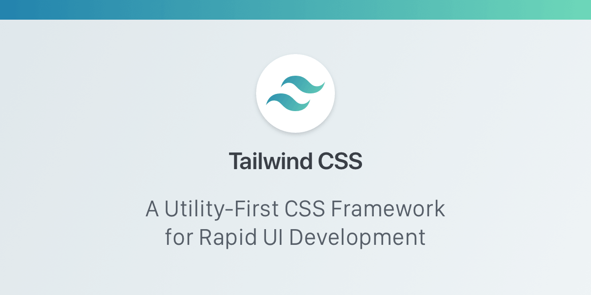
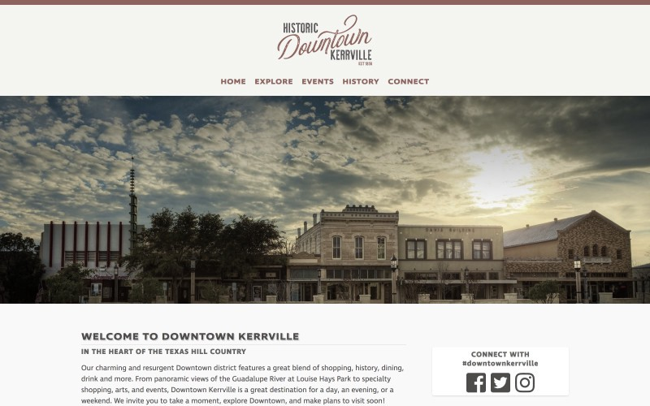

> This article was originally written on [Medium](https://medium.com/alara-creative/a-year-with-tailwind-92f420b2f8b9) and published on November 6, 2018.

A year-ish ago I started using [Tailwind CSS](https://medium.com/r/?url=https%3A%2F%2Ftailwindcss.com) from [Adam Wathan](https://medium.com/r/?url=https%3A%2F%2Ftwitter.com%2Fadamwathan%2F). If you haven't heard of it, you might want to check out my previous post, [A Week With Tailwind](https://medium.com/r/?url=https%3A%2F%2Fcodeburst.io%2Fa-week-with-tailwind-b5a5970b4093) in which I cover my first week with Tailwind. I'm not good at naming things.

Now that it's been out a year, I figured I'd do a follow up post and let everyone know that, yes, I'm still using Tailwind. It has found its way into every project we do here at [Alara](https://alaracreative.com). It doesn't matter if it's a simple [Statamic](https://statamic.com) brochure site or a more sophisticated Laravel or Nuxt site, we always start with Tailwind. I even made a Tailwind Sketch file so our non-coding designers could play too. I'd share it, but we have some other in-house objects in there and Sketch has been crashing often for me, so no.

Even after all these months using it, it's interesting to see the same objections being thrown at it, before anyone even tries it. I'm not sure why that is, but give it a chance gang, you'll like it. In the meantime, I'll try to tackle a few of those objections.

---

## It's too hard to maintain long-term
In the last year, we have had to go back to older projects, some from before the previous year, some within. The sites that aren't using tailwind are actually a bit of a pain to work on. Mostly due to Grunt/Gulp files that no longer compile due to non-compatible components. Since we maintain hundreds of clients over many years, it's not feasible to keep all the components up-to-date at all times, so when they need updates, we have to update.

With Tailwind projects, we can largely skip that entire process. Just a few tweaks to an HTML or Blade file and we're up and running. A large part of those can be done from github.com without pulling any code. A big time saver when the client just wants a couple of small changes. I know, I know, don't edit on the server, whatever I can do what I want. I'm a rebel Dottie, a loner.

---

## Too many classes leave the markup looking ugly
All those classes that "litter" the HTML? Yeah, they still do. And I'm still OK with it. If the line gets unwieldy long, I'll either drop the attributes to their own line Vue style, or will just create a component and actually use the CSS file. I can probably count on one hand the number of times I've done that.

Speaking of Vue, as of version 0.6 or something of Tailwind, you can now use @apply in your Vue templates. That was huge in the last large scale Vue/Nuxt project we did. Scoped styles in the components are quite useful. And portable. Now the styles aren't in a CSS file someone has to go hunt down later, they are just at the bottom of the template. Simple.

---

## Everything looks the same
So one of my initial points was that Bootstrap made all the sites look the same. Isn't that the same with Tailwind? Don't all the sites look the same? Well, yes and no. When I'm building a backend, I usually just use a default Tailwind config file. Very few changes, and those are usually adding in custom padding or margins to fit what I need. So yeah, all the UI I do for backend admin panels look similar. I might change the primary color to match the brand. Depends on the client.

Front end design? Not similar at all. Here's [a site we did for our hometown](https://downtownkerrville.com), Kerrville, Texas. Now here's one we did for [a local BBQ joint](https://billsbbq.net). Not too similar. For better examples, hit up [Built with Tailwind](https://builtwithtailwind.com).

Again, you'll get what you put into it. Spend time using the tools and crafting a design, you'll get an easy to update codebase that looks unique. Just using the default Tailwind config? That's cool, you'll have a really clean looking site that is again, easy to update in the future.

---

## Third-party fun
Extending Tailwind has also been helpful. There are a few good plugins out there, but creating your own is pretty simple. One of my favorites is [Aspect Ratio](https://medium.com/r/?url=https%3A%2F%2Fgithub.com%2Fwebdna%2Ftailwindcss-aspect-ratio) I use it pretty often.

Another third-party tool that has been helpful for our team is [Tailwind Color Generator](https://medium.com/r/?url=https%3A%2F%2Fjavisperez.github.io%2Ftailwindcolorshades%2F). Pop in a hex value and it generates the light/dark shades for you. I've only had one or two that needed tweaking, for the most part it hits the mark.

---

## Are you still here?
Bottom line, for our team Tailwind is here to stay. It's being used in official Laravel packages, Nuxt has it as a setup option, even Pizza Hut (UK) is using it. If you haven't given it a go yet, what's stopping you?

## More of Me
Should you want more of me (weirdo), please visit me at [scottzirkel.com](https://scottzirkel.com) or follow me on [Medium](https://medium.com/@scottzirkel).
